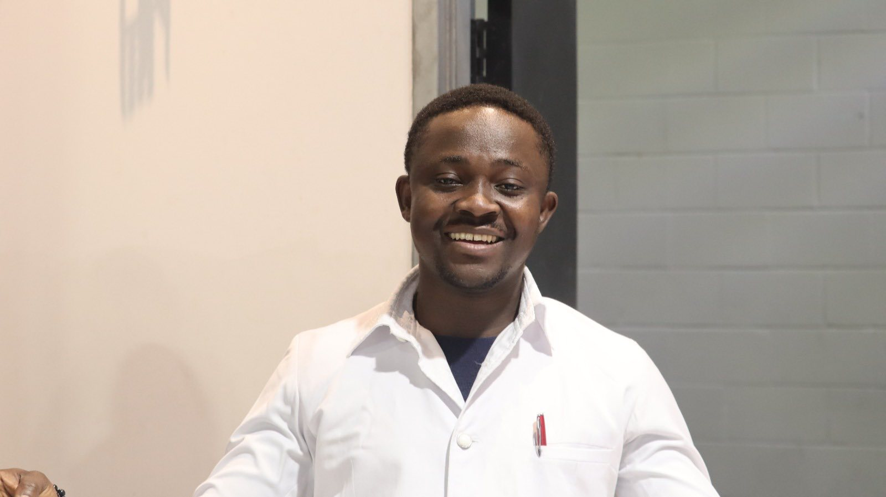

# Bernard Owusu-Mensah

  

## About Me

I am a Software Engineer and aspiring researcher with a strong interest in Artificial Intelligence, Data Engineering, and Intelligent Systems. My work focuses on building scalable software systems and exploring how emerging AI technologies can be applied to solve complex real-world problems.

My research interests lie at the intersection of **Large Language Models (LLMs), Agentic AI, Retrieval-Augmented Generation (RAG), Distributed Systems, and Data-Driven Applications**.

I am passionate about designing intelligent systems that combine machine learning, software engineering principles, and data infrastructure to create reliable and impactful solutions.

---

## Research Interests

- Artificial Intelligence
- Agentic AI and Multi-Agent Systems
- Large Language Models (LLMs)
- Retrieval-Augmented Generation (RAG)
- Information Retrieval
- Data Engineering
- Distributed Systems
- Database Systems
- Intelligent Information Systems

---

## Current Research

### Intelligent Multi-Agent Systems for Knowledge Discovery

Currently exploring the design and development of intelligent AI agents capable of:

- Automating survey generation and research workflows
- Performing semantic analysis and information extraction
- Enhancing knowledge discovery using Large Language Models
- Building AI-driven systems for decision support and analytics

---

## Education

### Bachelor of Science (B.Sc.) — Computer Science  
**Kwame Nkrumah University of Science and Technology (KNUST), Ghana**

Relevant coursework:
- Data Structures and Algorithms
- Database Systems
- Artificial Intelligence
- System Design and Analysis

### Postgraduate Diploma — Web Development  
**Humber Polytechnic, Canada**

Focus areas:
- Full Stack Software Development
- Web Application Architecture
- Database Design
- Cloud-Based Application Development
## Selected Research & Software Projects

### AI Research Director Agent
An intelligent AI agent designed to support research workflows through:
- Automated survey generation
- Data analysis assistance
- Knowledge extraction using Large Language Models

Technologies:
`Python` `LLMs` `AI Agents` `Natural Language Processing`
Technologies:
`Web Development` `Database Systems` `Full Stack Architecture`

###  Purchs
A full-stack application focused on scalable web architecture.

Technologies:
`React` `Node.js` `MongoDB` `Cloud Deployment`

###  Yadag
An administrative dashboard application.

Technologies:
`Laravel` `PHP` `AWS EC2`

---

## Technical Skills

### Programming Languages
`Python` `C#` `JavaScript` `TypeScript` `PHP`

### Artificial Intelligence & Data
`Machine Learning` `LLMs` `RAG` `NLP` `Data Analytics` `Data Engineering`

### Software Engineering
`ASP.NET Core` `React` `Angular` `Laravel` `Node.js`

### Databases
`SQL Server` `PostgreSQL` `MySQL` `MongoDB`

### Cloud & DevOps
`Azure` `AWS` `Docker` `CI/CD` `GitHub Actions`

---

## Academic Goals

I am seeking graduate research opportunities in:

- Artificial Intelligence - Data Engineering
- Distributed Systems
- Intelligent Information Systems
- Human-Centered AI Applications

I am particularly interested in research environments focused on developing scalable AI systems, knowledge-driven applications, and next-generation intelligent computing solutions.

---

## Connect With Me

🌐 **Portfolio:**  
https://bernardowusumensah.github.io/codeBernard/

💻 **GitHub:**  
https://github.com/bernardowusumensah

🔗 **LinkedIn:**  
https://www.linkedin.com/in/owusu-mensah-bernard-77a62aaa/

📧 **Email:**  
tgatelbernard@gmail.com
